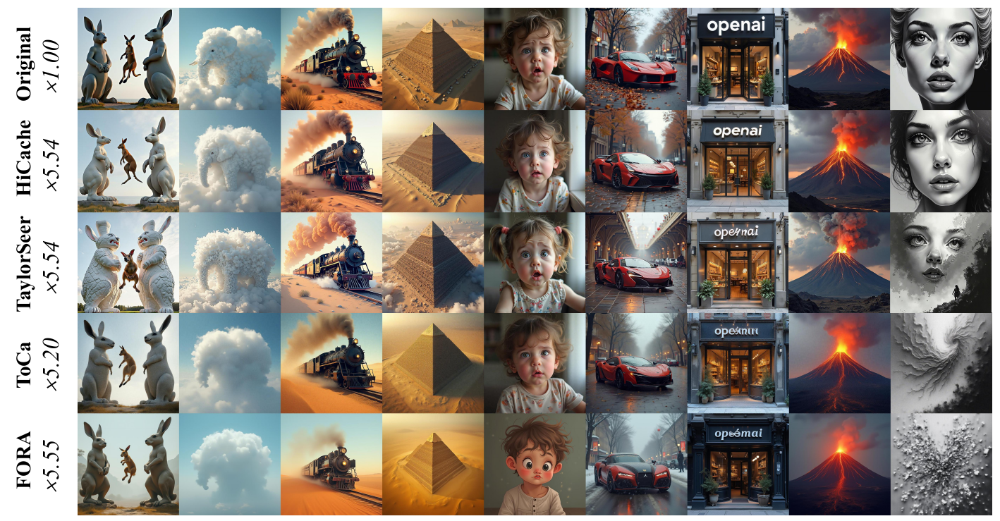
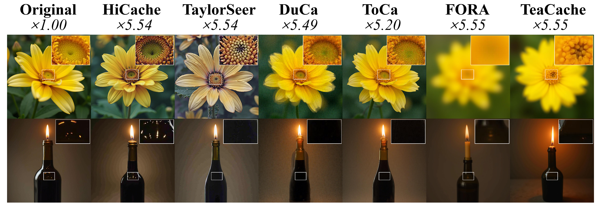
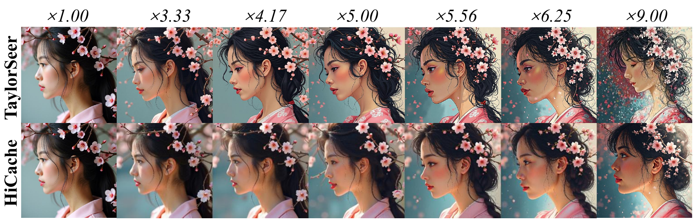
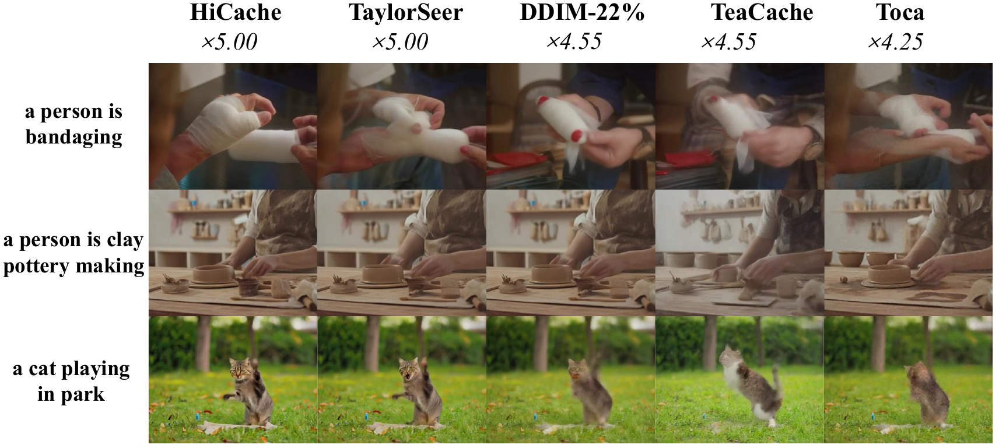
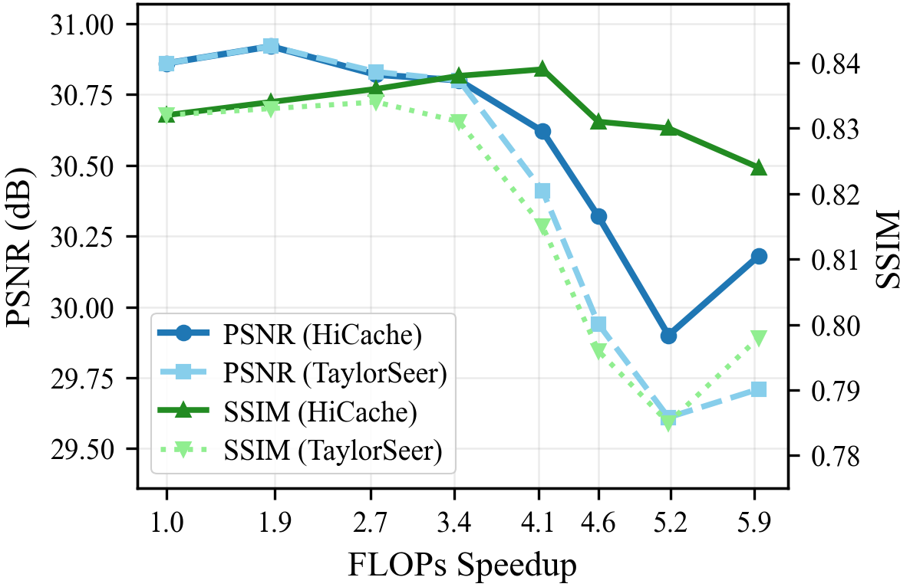

<p align="center">
  <h1 align="center">HiCache</h1>
  <p align="center">
    <em>A Plug-in Scaled-Hermite Upgrade for Taylor-Style Cache-then-Forecast Diffusion Acceleration</em>
  </p>
  <p align="center">
    <a href="https://arxiv.org/abs/2508.16984"></a>
    <a href="./LICENSE"></a>
    <a href="https://iclr.cc/Conferences/2026"></a>
  </p>
  <p align="center">
    English | <a href="./README_CN.md">简体中文</a>
  </p>
  <p align="center">
    <a href="#quick-start">Quick Start</a> •
    <a href="#supported-backends">Backends</a> •
    <a href="#story">Story</a> •
    <a href="#usage">Usage</a> •
    <a href="#results">Results</a> •
    <a href="#license">License</a>
  </p>
</p>

---

## 📄 Abstract

Diffusion models have achieved remarkable success in content generation but suffer from prohibitive computational costs due to iterative sampling. While recent feature caching methods tend to accelerate inference through temporal extrapolation, these methods still suffer from severe quality loss due to the failure in modeling the complex dynamics of feature evolution. 

To solve this problem, this paper presents **HiCache** (**H**erm**i**te Polynomial-based Feature **Cache**), a training-free acceleration framework that fundamentally improves feature prediction by aligning mathematical tools with empirical properties. Our key insight is that feature derivative approximations in Diffusion Transformers exhibit multivariate Gaussian characteristics, motivating the use of Hermite polynomials—the potentially theoretically optimal basis for Gaussian-correlated processes. Besides, we introduce a **dual-scaling mechanism** that ensures numerical stability while preserving predictive accuracy, which is also effective when applied standalone to TaylorSeer.

Extensive experiments demonstrate HiCache's superiority: achieving **5.55× speedup** on FLUX.1-dev while exceeding baseline quality, maintaining strong performance across text-to-image, video generation, and super-resolution tasks. Moreover, HiCache can be naturally added to the previous caching methods to enhance their performance, *e.g.*, improving ClusCa from 0.9480 to 0.9840 in terms of image rewards.

---

## ✨ Features

- **HiCache Acceleration** — Hermite polynomial-based feature caching for efficient diffusion sampling
- **Multi-Backend Support** — FLUX, Qwen-Image, Qwen-Image-Edit, Chipmunk-Flux
- **Flexible Deployment** — Single GPU & Multi-GPU launcher included
- **Easy Integration** — Simple `pip install -e ".[all]"` setup

> [!NOTE]
> Model weights / checkpoints are **not** included in this repository.

> [!TIP]
> **TODO**
> - [ ] Release Inf-DiT super-resolution acceleration code

---

## 🧩 Story

HiCache is my first top-conference first-author paper. Research is delayed gratification under uncertainty: the project was finished in late July 2025, first submitted to AAAI and rejected, then re-submitted to ICLR and finally accepted at ICLR 2026 after rebuttal—often it takes half a year (or more) from “done” to “officially on the list”.

Behind HiCache is also the second half of my own transition—from being recommended for admission to Fudan’s Master of Finance (professional degree) to becoming an AI pre-PhD researcher (a prospective PhD applicant). Starting from March 2025, I decided to stop job-hunting and start applying for PhD programs, interning at Prof. Zhang’s EPIC Lab while still taking finance courses; I spent long days commuting between Fudan and SJTU (Xuhui), and the lab community was a big part of what kept me going.

Before that, I also went through a “finance → engineering” turn: after securing my recommendation for admission (to Fudan’s Master of Finance), I spent months learning backend engineering and later interned as a backend engineer at ByteDance, which helped me clarify what I truly wanted to pursue.

Technically, HiCache almost didn’t happen: it grew out of a PlanB Hermite direction that my junior collaborator (Shikang Zheng) was close to abandoning. We initially worked on applying TaylorSeer to super-resolution acceleration; after repeatedly hitting walls on video models, we pivoted to better cache-forecast algorithms. Shikang found two promising paths (FOCA and Hermite) and chose to focus on FOCA. At that moment, I was under the pressure of needing a first-author paper for my AI PhD applications; with Prof. Zhang’s suggestion, I revisited Hermite and contributed a key improvement (e.g., the dual-scaling trick for basis functions), turning it into HiCache. In roughly four months, we completed two conference works: FOCA (accepted at AAAI) and HiCache (rejected at AAAI first, then accepted at ICLR).

More context and notes on my journey (FinTechMath):
- Zhihu: <https://zhuanlan.zhihu.com/p/1999383695040213067>
- Xiaohongshu: <https://www.xiaohongshu.com/discovery/item/6977f8e20000000021029ef5?source=webshare&xhsshare=pc_web&xsec_token=ABpAzypbjtoTrduA2sdYDFRliw8EG3UeRJmUN4Q1f2aIU=&xsec_source=pc_share>

---

## 🚀 Quick Start

```bash
# Create and activate virtual environment
python3.10 -m venv .venv
source .venv/bin/activate

# Install dependencies
pip install --upgrade pip
pip install -e ".[all]"
```

---

## 🎯 Supported Backends

| Backend           | Description                     | Status |
| ----------------- | ------------------------------- | ------ |
| **FLUX**          | Text-to-image generation        | ✅      |
| **Qwen-Image**    | Text-to-image generation        | ✅      |
| **Qwen-Image-Edit** | Image editing                 | ✅      |
| **Chipmunk-Flux** | Backend experiments             | ✅      |

---

## 📖 Usage

### Unified Launcher (Single / Multi-GPU)

#### FLUX

```bash
# Single GPU: --gpus 0 ; Multi GPU: --gpus 0,1
bash RUN/multi_gpu_launcher.sh --backend flux --mode HiCache --gpus 0 \
  --prompt_file resources/prompts/prompt.txt --output_dir outputs/hicache
```

#### Qwen-Image

```bash
# Recommended: pass a python interpreter from your Qwen env
bash RUN/multi_gpu_launcher.sh --backend qwen-image --python /path/to/python -- \
  --model_path /path/to/Qwen-Image --output_dir outputs/qwen_image
```

---

## 📊 Results

### Text-to-Image Generation (FLUX.1-dev)

HiCache achieves **5.55× speedup** with superior image quality compared to baseline methods.

<p align="center">
  
</p>

<p align="center"><em>Qualitative comparison across diverse prompts. HiCache produces results with higher fidelity compared to TaylorSeer and other baselines.</em></p>

### Detail Preservation & Style Consistency

<p align="center">
  
</p>

<p align="center"><em>High-frequency detail preservation: HiCache retains fine details better than competing methods.</em></p>

<p align="center">
  
</p>

<p align="center"><em>Consistent style and clean backgrounds under varying acceleration ratios.</em></p>

### Text-to-Video Generation (HunyuanVideo)

<p align="center">
  
</p>

<p align="center"><em>Superior temporal consistency and frame quality compared to other acceleration methods.</em></p>

### Image Super-Resolution (Inf-DiT)

<p align="center">
  
</p>

<p align="center"><em>HiCache achieves ~5.93× theoretical speedup while maintaining comparable PSNR and SSIM.</em></p>

---

## 📦 Weights & Paths

### FLUX Weights

Place FLUX weights under `resources/weights/` (not tracked by git):

```bash
huggingface-cli download black-forest-labs/FLUX.1-dev \
  --local-dir resources/weights/FLUX.1-dev \
  --local-dir-use-symlinks False
```

### Qwen Weights

Qwen-Image / Qwen-Image-Edit weights should be provided via:
- `--model_path` argument, or
- Environment variable: `QWEN_IMAGE_MODEL_PATH`

---

## 📁 Project Structure

```
HiCache/
├── models/                 # Model implementations
│   ├── flux/              # FLUX backend
│   ├── qwen_image/        # Qwen-Image backend
│   ├── qwen_image_edit/   # Qwen-Image-Edit backend
│   ├── chipmunk/          # Chipmunk-Flux experiments
│   └── hicache_fast_impl.py  # Core HiCache implementation
├── scripts/               # Utility scripts
├── RUN/                   # Launch scripts
└── resources/             # Prompts, weights, licenses
```

---

## 📄 License

| Component          | License                                                        |
| ------------------ | -------------------------------------------------------------- |
| **This Repository** | [GPL-3.0](./LICENSE)                                          |
| **Model Weights**  | See `resources/third_party/model_licenses/`                    |
| **Vendored Code**  | See `resources/third_party/code_licenses/` (e.g., Apache-2.0)  |

---

## 📚 Citation

If you find HiCache useful, please cite our paper:

```bibtex
@inproceedings{feng2026hicache,
  title={HiCache: A Plug-in Scaled-Hermite Upgrade for Taylor-Style Cache-then-Forecast Diffusion Acceleration},
  author={Feng, Liang and Zheng, Shikang and Liu, Jiacheng and Lin, Yuqi and Zhou, Qinming and Cai, Peiliang and Wang, Xinyu and Chen, Junjie and Zou, Chang and Ma, Yue and Zhang, Linfeng},
  booktitle={International Conference on Learning Representations (ICLR)},
  year={2026}
}
```
